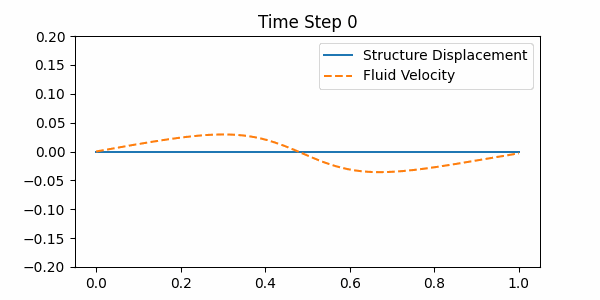

# Fluid-Structure Interaction (FSI) Simulation
This project simulates a fluid-structure interaction (FSI) system, where a deformable structure interacts with a flowing fluid in a 1D domain. The simulation solves the coupled Navier-Stokes equations for the fluid and the elastic wave equation for the structure.
## 📌 Features
* Fluid simulation: Solves for velocity and pressure using explicit time integration.
* Structure simulation: Simulates elastic deformation using Young’s modulus.
* Coupling mechanism: Enforces interaction between the fluid and the structure.

## 📜 Dependencies
* This project is written in C++ and requires:
* A C++ compiler (e.g., GCC, MinGW, Clang)
* Python + Matplotlib for visualization
## ⚙️ Compilation & Execution
### Compile the Code
`` g++ fsi_solver.cpp -o fsi_solver.exe ``
### Run the Simulation
``./fsi_solver.exe``
## 📊 Visualization

    

## 🛠 Troubleshooting
If the simulation is unstable or nan values appear:
* Reduce dt (e.g., dt = 0.0001)
* Add damping to the structure update
* Scale down pressure force (p[i] *= 0.1)
* Use smaller initial displacements
